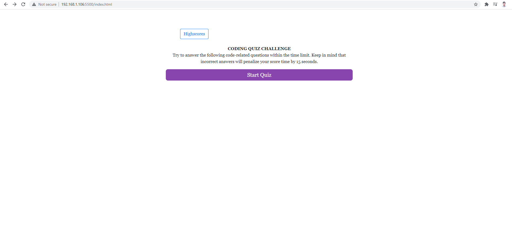

<h1 align="center"> WEB APIs - CODE QUIZ 🚩</h1>
<br>
<p align="center">
  <a href="#">
  
  <a href="#">
  
  <a href="#">
  
  <a href="#">
  
  <a href="#">
  
  <a href="#">
  
  <br>
  <a href="https://www.buymeacoffee.com/adampham123">
  
  <a href="#">
  
  <a href="#">
  
  <a href="https://github.com/ThiHoangPham/code-quiz/blob/main/LICENSE">
  
  </a>
  <a href="#">
  
  <a href="#">
  
  </a>
  <a href="#">
  
  </a>
  <a href="#">
  
  </a>
  <a href="#">
  
  </a>
</p>
<hr>

  <h3 align="center">
    <p align="center">
      <a href="https://github.com/ThiHoangPham/code-quiz"><strong>Explore the docs »</strong></a>
      <br />
      <br />
      <a href="https://thihoangpham.github.io/code-quiz/">Demo</a>
      ·
      <a href="https://github.com/ThiHoangPham/code-quiz/issues">Report Bug</a>
      ·
      <a href="https://github.com/ThiHoangPham/code-quiz/issues">Request Feature</a>
    </p>
  </table>

  <details>
    <summary>Table of Contents</summary>
    <ul>
      <li><a href="#about-the-project">About The Project</a>
      <li><a href="#user-story">User Story</a></li>
      <li><a href="#acceptance-criteria">Acceptance Criteria</a></li>
      <li><a href="#live-demo-github">Live Demo</a></li>
      <li><a href="#contributor">Contributor</a></li>
      <li><a href="#contribution">Contribution</a></li>
      <li><a href="#license">License</a></li>
      <li><a href="#more-about-me">More About Me</a></li>
    </ul>
  </details>

  <br />

# About The Project
  A timed coding quiz with multiple-choice questions. This app will run in the browser and will feature dynamically updated HTML and CSS powered by JavaScript code that you write.
  


# User Story
```
AS A coding boot camp student
I WANT to take a timed quiz on JavaScript fundamentals that stores high scores
SO THAT I can gauge my progress compared to my peers
```

# Acceptance Criteria
```
GIVEN I am taking a code quiz
WHEN I click the start button
THEN a timer starts and I am presented with a question
WHEN I answer a question
THEN I am presented with another question
WHEN I answer a question incorrectly
THEN time is subtracted from the clock
WHEN all questions are answered or the timer reaches 0
THEN the game is over
WHEN the game is over
THEN I can save my initials and my score
```

# Live Demo Github: 
<a href="https://thihoangpham.github.io/code-quiz/">
  
  </a>

# Contributor
<a href="https://github.com/ThiHoangPham/code-quiz">
  
  </a>

# Contribution
This how you can contribute to this project:
```
> Clone the project to your local 
> Create your own branch
> Add contribution codes/commit/push to remote repo
> Create a pull request
```
# License
  Distributed under the [MIT License](https://github.com/ThiHoangPham/code-quiz/blob/main/LICENSE)

# More About Me
  <a href="https://github.com/ThiHoangPham">
  
  <a href="https://thihoangpham.github.io/react-portfolio/">
  
  <a href="https://www.linkedin.com/in/thaihoangpham/">
  
  <a href="mailto:thaihoangpham2008@gmail.com">
  
  </br>
  <p align ="right"><a href="#">↥ back to top</a></p>

- - -

© 2021 Hoang Thai Pham(Adam): Web APIs - Code Quiz